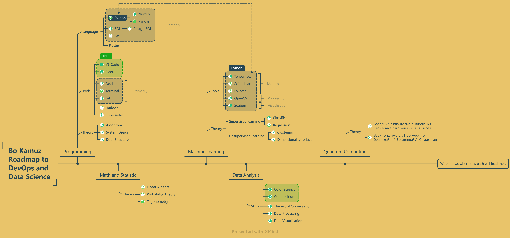

# Bo Kamuz

<!--
**bkamuz/bkamuz** is a ✨ _special_ ✨ repository because its `README.md` (this file) appears on your GitHub profile.

Here are some ideas to get you started:

- 🔭 I’m currently working on ...
- 🌱 I’m currently learning ...
- 👯 I’m looking to collaborate on ...
- 🤔 I’m looking for help with ...
- 💬 Ask me about ...
- 📫 How to reach me: ...
- 😄 Pronouns: ...
- ⚡ Fun fact: ...
-->

## Self-Education

* [DataCamp Specialization "Data Scientist with Python"](https://www.datacamp.com/profile/bkamuz)
* [DataCamp Track "Python Fundamentals"](https://www.datacamp.com/profile/bkamuz)
* [Coursera "IBM Data Science"](https://coursera.org/share/fc6414fbd3299902d096e489e1d00161)

## Degree

* Bachelor degree in architecture and construction, Donbas National Academy of Civil Engineering and Architecture, 2014

## Scientific Interests

* Quantum Computation / Information
* Audio/Visual Processing (music production / medicine)
* Automation
* Patterns and Prediction Models
* Machine Learning
* Data Mesh
* Network Analysis & Graph Theory

A Roadmap for becoming a Data Scientist / Engineer

  
I've been working in civil and industrial design using BIM technologies since 2015.
My work has been indirectly related to Python programming language mainly to automate routine work.
Due to the fact that I do not see for myself a further way as a BIM specialist, I decided to change the field of activity to a more interesting and promising.
After some research - possible directions of development that I'm interested in are DevOps and Data Science\Engineering.
After I've talked with practicing people in programming I've made my own RoadMap according to their recommendations.

[Roadmap X-mind link](https://xmind.works/share/ESvOuG73) (or see saved Roadmap image below)

Roadmap Image

[Research projects list](https://github.com/bkamuz/data-science)

<!-- [A road-map for becoming a Data Scientist / Engineer](https://github.com/bkamuz/bkamuz/blob/main/ROADMAP.md) -->

## Main Skills

* Python + ML (Pandas, NumPy, SeaBorn, OpenCV, SciKit-learn, Tensorflow)
* Data Engineering (SQL)
* Linux, Bash, Git

## Additional Skills

* PineScript, FreqTrade
* Cycling74 Max

## Expertise

* Data Science and Analytics
* Automation

## Projects

* Audio And MIDI virtual devices (MaxMSP): more than [8000 free downloads](https://maxforlive.com/profile/user/zaSLON) and over [1000 paid purchases](https://soundaround.gumroad.com/) - Open Source
* Trading bot (FreqTrade): Python crypto trading bot project - trading strategy developed, the bot is running in the cloud (Oracle Instance)
* GPT-3.5 telegram bot (OpenAI): [Птица Говорун](https://t.me/chat_govorun_bot)

## Experience
<!--  -->

* Data Scientist, [Self-Employed](https://www.notion.so/bkamuz/Kamuz-Bo-d3f0e69c00a941ac847ab8ff949d87e3) : 2023 - now (Remote)

* Plan and Control Specialist, [PlanIt Inc.](https://planit-inc.com/) : 2015 - 2022 (Head Office: Oakland, CA, USA)

* Audio Software Developer, Personal Project [Sound Around](http://bkamuz.tilda.ws/en/else) : 2018 - 2022 (Remote)
