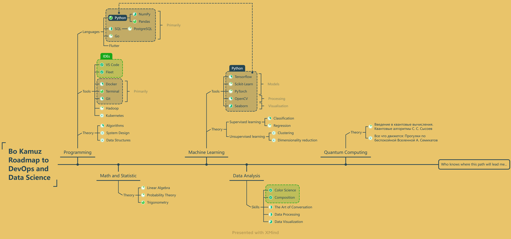

# Welcome Word

I've been working in civil and industrial design using BIM technologies since 2015. 
My work has been indirectly related to Python programming language mainly to automate routine work. 
Due to the fact that I do not see for myself a further way as a BIM specialist, I decided to change the field of activity to a more interesting and promising.
After some research - possible directions of development that I'm interested in are DevOps and Data Science\Engineering.
After I've talked with practicing people in programming I've made my own RoadMap according to their recommendations.

[Roadmap link](https://xmind.works/share/ESvOuG73) (or see saved Roadmap image below)

[Research projects list](https://github.com/bkamuz/data-science)

[CV link](https://github.com/bkamuz/bkamuz/bkamuz)
